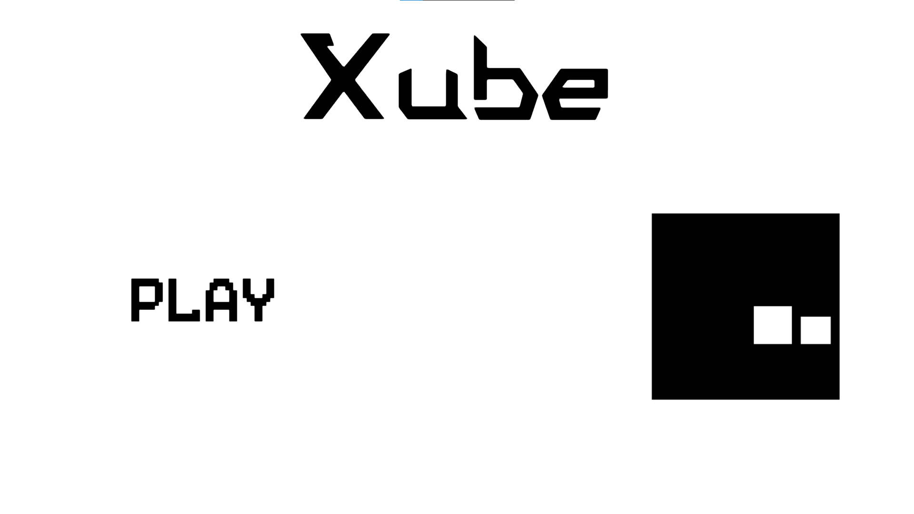
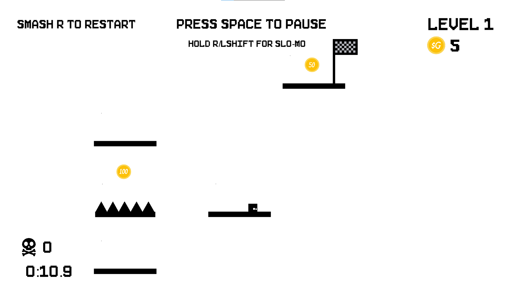

# Xube

## Overview

This project involves the development of a dynamic 2D platformer game using Unity and C#. It features ten thoughtfully designed levels to challenge players' skills. Through extensive testing and optimization, gameplay is seamless and responsive. Emphasizing speedrunning, players aim to complete levels with minimal deaths, enhancing engagement and promoting mastery of game mechanics.

## Preview
#### Main Page

#### Gameplay


### Installing
1. Clone the repository:
   ```bash
   git clone https://github.com/RadAntonio/Xube.git
   ```
2. Open the folder and click 
    ```bash
   Xube.exe
   ```
## Contributing
Contributions are welcome and greatly appreciated. If you have suggestions for improving this application, please fork the repo and create a pull request or open an issue.

1. Fork the Project
2. Create your Feature Branch (`git checkout -b feature/AmazingFeature`)
3. Commit your Changes (`git commit -m 'Add some AmazingFeature'`)
4. Push to the Branch (`git push origin feature/AmazingFeature`)
5. Open a Pull Request

## License
This project is licensed under the MIT License - see the [LICENSE](LICENSE) file for details.